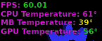

# TrisquelStuff
This is a repository for Trisquel customization stuff.

[OpenBox]

//------------------Bars------------------//

.conkyrc_bar: lower Conky bar with some stats and system infos (to be put in ~/).

tint2rc: tint2 panel configuration file (to be put in ~/.config/tint2).

//------------------Fonts------------------//

RetroGotham: minimalistic Conky theme with a clock and a calendar (to be put in ~/).

pf_arma_five.ttf: font used in Trisquel Window Manager (to be put in ~/.fonts).

Retro Computer.ttf: font used in RetroGotham Conky theme (to be put in ~/.fonts).

Nitti-Normal.ttf: font used in xterminal (to be put in ~/.fonts).

//------------------Windows & Colors------------------//

Nightmare01.tar.gz: modified window borders theme (thanks to MAXIM2, original url: https://www.box-look.org/content/show.php/Nightmare+?content=165646, to be extracted in /usr/share/themes).

Palette.png: three colors i used in my Trisquel configuration.

//------------------Icons & Cursors------------------//

Rage-Cursor.tar.gz: cursor theme (thanks to DARKEYE90, original url: https://www.gnome-look.org/p/1280103/, to be extracted in ~/.icons).

Paper Icon Theme: open-source freedesktop.org icon theme project (https://snwh.org/paper).

//------------------Hotkeys------------------//

.xbindkeysrc: xbindkeys keyboard shortcuts file (to be put in ~/)

[AwesomeVM]

//------------------Scripts------------------//

christmas.sh: Christmas tree script for terminal, put everywhere (~/Script)

cpufreq-set-all: this script sets different CPU frequencies, put everywhere (~/Script)

freemem: this script frees RAM and helps system getting smoother, put everywhere (~/Script)

playgames: main script for selecting a game and running it, needs other scripts, put into /usr/bin

terminal_tree.py: another Christmas tree script, this time in Python, put everywhere (~/Script)

//-------------------Game configurations--------------------//

Config.fs-uae: FS-UAE Amiga emulator configuration (put into ~/.local/share/lutris/runners/fs-uae)

dgenrc: DGen SEGA Genesis emulator configuration (put into ~/.dgen)

dosbox-ECE.conf: DOSBox configuration (put into ~/.dosbox)

retroarch.cfg: Retroarch multisystem emulator configuration (put into ~/.local/share/lutris/runners/retroarch)

//-------------------Generic configurations--------------------//

Vanack.json: ArchiSteamFarm profile configuration (put into config folder into ArchiSteamFarm main directory)

bookmarks.html: Firefox/Tor Browser bookmarks (import from browser)

compton.conf: Compton configuration (put into ~/.config)

hrir.wav: WAV sample file for 7.1 surround sound configuration (put into ~/.local/share)

[GLXOSD]

formatterfunction*: config files for sensors (FPS, GPU, CPU) (delete all after formatterfunction and put in /etc/GLXOSD/OSD/DataProviders/FrameDataProvider or /etc/GLXOSD/OSD/DataProviders/LibSensorsDataProvider or /etc/GLXOSD/OSD/DataProviders/NVMLDataProvider)

glxosd_config.lua: configuration file for GLXOSD (see screenshot below) (to be put in /etc/GLXOSD/)

[General]

//------------------Wallpaper------------------//

Trisquel Nebula.jpg: this is a custom 1080p wallpaper made by the Arch Nebula wallpaper, adding Trisquel logo (with some effects to make it fit the space atmosphere) and removing the lower "SD" letters.

//------------------Screensavers------------------//

.xscreensaver: xscreensaver configuration file (to be put in ~/).
